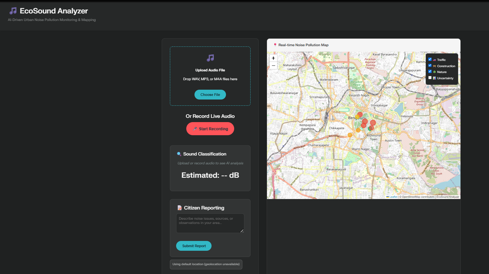
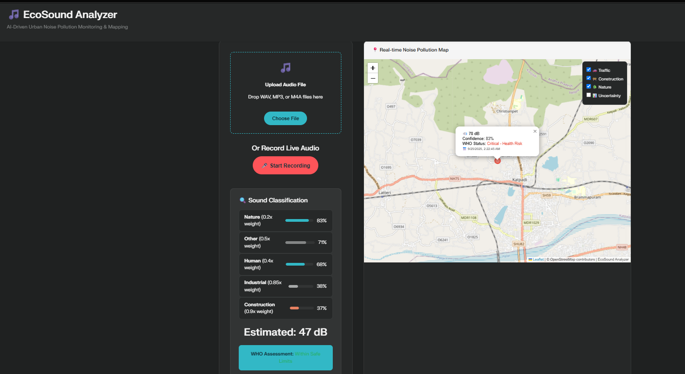

# EcoSound Analyzer - AI-Driven Urban Noise Pollution Monitoring & Mapping


## Project Structure
```
ecosound-analyzer/
├── frontend/
│   ├── index.html              # Main HTML file
│   ├── css/
│   │   └── styles.css          # Main stylesheet
│   ├── js/
│   │   ├── main.js             # Core application logic
│   │   ├── ml-models.js        # ML/AI integration
│   │   ├── map-handler.js      # Leaflet map functionality
│   │   └── audio-processor.js  # Audio processing utilities
│   └── assets/
│       └── icons/              # UI icons (if needed)
├── backend/
│   ├── app.py                  # Flask main application
│   ├── models/
│   │   ├── __init__.py
│   │   ├── classifier.py       # ML model handlers
│   │   └── anomaly_detector.py # Anomaly detection logic
│   ├── routes/
│   │   ├── __init__.py
│   │   ├── audio.py            # Audio processing endpoints
│   │   ├── feedback.py         # Citizen feedback endpoints
│   │   └── prediction.py       # Noise prediction endpoints
│   ├── utils/
│   │   ├── __init__.py
│   │   ├── audio_features.py   # Feature extraction
│   │   └── db_handler.py       # Database operations
│   └── requirements.txt        # Python dependencies
├── models/
│   └── yamnet.h5               # Pre-trained ML model
├── data/
│   └── sample_data.json        # Sample noise data
└── README.md                   # Project documentation
```

## Description
This is a research-grade web application for real-time urban noise pollution monitoring using AI-powered sound classification and interactive mapping. The system processes audio through machine learning models, provides WHO compliance assessment, and visualizes noise pollution patterns on an interactive map.

## Screenshots



## Setup Instructions
Place all files according to the directory structure above

Open frontend/index.html in a web browser for the client-side demo

For full functionality, run the Flask backend from the backend/ directory

Ensure all dependencies are installed as specified in requirements.txt

## Research Features
Real-time audio classification using YAMNet/TensorFlow.js

WHO noise standard compliance assessment

Interactive geospatial visualization with Leaflet.js

Privacy-preserving feature extraction (MFCC only)

Anomaly detection and noise prediction

Citizen reporting and feedback integration