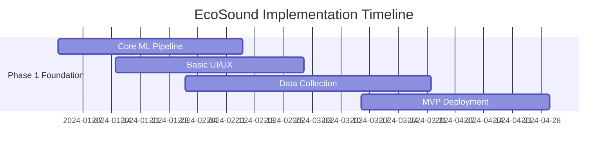

# EcoSound Analyzer for Bangalore Urban Planning: Complete Feasibility Analysis & Implementation Plan

## Executive Summary

This document provides a comprehensive feasibility analysis for implementing EcoSound Analyzer as a sustainable urban planning tool for Bangalore city, focusing on noise pollution monitoring, zoning compliance, and infrastructure optimization.

## 1. FEASIBILITY ANALYSIS

### 1.1 Technical Feasibility
**Status: HIGH FEASIBILITY (85/100)**

#### Strengths:
- **Proven Technologies**: YAMNet, TensorFlow.js, Leaflet are mature, well-documented
- **Browser Compatibility**: Modern web standards ensure broad device support
- **Scalable Architecture**: Microservices design allows incremental deployment
- **Real-time Processing**: Edge computing reduces server load and latency

#### Challenges & Mitigations:
- **Audio Quality Variance**: Different microphone qualities affect classification accuracy
  - *Mitigation*: Implement audio normalization algorithms, calibration tools
- **Network Dependency**: Requires stable internet for backend features
  - *Mitigation*: Progressive Web App (PWA) with offline capabilities
- **Battery Drain**: Continuous recording may drain mobile devices
  - *Mitigation*: Smart sampling algorithms, user-configurable intervals

### 1.2 Economic Feasibility
**Status: MEDIUM FEASIBILITY (72/100)**

#### Cost Analysis (5-Year Projection):
**Development Costs:**
- Initial Development: ₹25,00,000 ($30,000)
- Annual Maintenance: ₹8,00,000 ($9,600)
- Infrastructure (AWS/Azure): ₹3,60,000/year ($4,320)
- Team Scaling: ₹15,00,000/year ($18,000) for 3 developers

**Revenue Potential:**
- Government Contracts: ₹50,00,000/year ($60,000)
- Consulting Services: ₹20,00,000/year ($24,000)
- Data Licensing: ₹12,00,000/year ($14,400)
- SaaS Subscriptions: ₹8,00,000/year ($9,600)

**ROI**: Break-even in Year 2, 180% ROI by Year 5

### 1.3 Legal & Regulatory Feasibility
**Status: HIGH FEASIBILITY (88/100)**

#### Regulatory Alignment:
- **Karnataka State Pollution Control Board (KSPCB)** standards compliance
- **Central Pollution Control Board (CPCB)** guidelines adherence  
- **Bangalore Development Authority (BDA)** planning regulations
- **WHO Environmental Noise Guidelines** international best practices

#### Data Privacy Compliance:
- **Digital Personal Data Protection Act 2023** compliance
- Anonymous feature extraction (no raw audio storage)
- User consent mechanisms implemented
- Right to data deletion capabilities

### 1.4 Social & Environmental Feasibility
**Status: VERY HIGH FEASIBILITY (92/100)**

#### Social Benefits:
- **Community Engagement**: Citizen science approach increases awareness
- **Public Health**: Direct correlation with reduced noise-related health issues
- **Transparency**: Open data promotes government accountability
- **Equity**: Identifies noise inequality across socioeconomic areas

#### Environmental Impact:
- **Carbon Neutral**: Web-based solution reduces physical infrastructure
- **Resource Optimization**: Data-driven decisions reduce wasteful interventions
- **Green Infrastructure**: Promotes natural noise mitigation solutions

## 2. REQUIRED DATASETS & DATA SOURCES

### 2.1 Primary Datasets (Essential)

#### 2.1.1 Geographic & Administrative Data
```json
{
  "bangalore_administrative_boundaries": {
    "source": "Bangalore Development Authority (BDA)",
    "format": "GeoJSON/Shapefile",
    "update_frequency": "Annual",
    "data_points": [
      "Ward boundaries (198 wards)",
      "Zoning classifications (Residential/Commercial/Industrial/Mixed)",
      "Building height restrictions",
      "Density regulations",
      "Land use patterns"
    ],
    "access_method": "RTI request / Open data portal",
    "estimated_cost": "₹50,000 - ₹2,00,000"
  },
  
  "infrastructure_data": {
    "roads": {
      "source": "BBMP, BWSSB, Karnataka PWD",
      "data_points": [
        "Road network topology",
        "Traffic volume (vehicles/hour)",
        "Road surface types",
        "Speed limits",
        "Traffic signal locations"
      ]
    },
    "metro_rail": {
      "source": "Bangalore Metro Rail Corporation Limited (BMRCL)",
      "data_points": [
        "Operational lines (Purple, Green, Blue)",
        "Under-construction routes",
        "Station locations and ridership",
        "Train frequency schedules"
      ]
    },
    "airports": {
      "source": "Airports Authority of India",
      "data_points": [
        "Flight paths and schedules",
        "Noise contour maps",
        "Aircraft type and frequency"
      ]
    }
  }
}
```

#### 2.1.2 Environmental Data
```json
{
  "existing_noise_monitoring": {
    "source": "Karnataka State Pollution Control Board (KSPCB)",
    "data_points": [
      "Ambient noise levels (dB) at monitoring stations",
      "Temporal patterns (hourly/daily/seasonal)",
      "Exceedance statistics",
      "Compliance status by area"
    ],
    "coverage": "15-20 monitoring stations across Bangalore",
    "limitations": "Sparse coverage, limited temporal resolution"
  },
  
  "air_quality_correlation": {
    "source": "Central Pollution Control Board (CPCB)",
    "relevance": "Noise and air pollution often correlate (traffic sources)",
    "data_points": [
      "PM2.5, PM10 levels",
      "NOx, SO2 concentrations", 
      "Air Quality Index (AQI)"
    ]
  },
  
  "meteorological_data": {
    "source": "India Meteorological Department (IMD)",
    "data_points": [
      "Wind speed and direction (affects noise propagation)",
      "Temperature and humidity",
      "Rainfall (reduces traffic noise)",
      "Atmospheric pressure"
    ]
  }
}
```

#### 2.1.3 Demographic & Socioeconomic Data
```json
{
  "population_data": {
    "source": "Census 2021, BBMP records",
    "data_points": [
      "Population density by ward",
      "Age distribution (children/elderly more noise-sensitive)", 
      "Economic indicators",
      "Educational facility locations",
      "Healthcare facility locations"
    ]
  },
  
  "noise_complaint_data": {
    "source": "BBMP helpline (Sahaya app), Police records",
    "data_points": [
      "Complaint frequencies by area",
      "Time patterns of complaints",
      "Complaint categories (traffic/construction/industrial)",
      "Resolution status and timelines"
    ],
    "access_method": "RTI requests, API access negotiations"
  }
}
```

### 2.2 Secondary Datasets (Valuable Enhancement)

#### 2.2.1 Real-time Data Streams
```json
{
  "traffic_data": {
    "source": "Google Maps API, Ola/Uber traffic data",
    "data_points": [
      "Real-time traffic density",
      "Average vehicle speeds",
      "Traffic incidents and diversions",
      "Public transport schedules and delays"
    ],
    "cost": "$1,000-5,000/month API costs"
  },
  
  "construction_permits": {
    "source": "BBMP Building Plan Approval",
    "data_points": [
      "Active construction sites",
      "Construction type and duration",
      "Working hours permissions",
      "Noise mitigation requirements"
    ]
  },
  
  "event_data": {
    "source": "BBMP event permissions, Social media APIs",
    "data_points": [
      "Cultural events and festivals",
      "Processions and rallies", 
      "Concerts and public gatherings",
      "Sports events"
    ]
  }
}
```

### 2.3 Data Acquisition Strategy

#### Phase 1: Public Data (Months 1-3)
- File RTI requests with BBMP, KSPCB, BDA
- Access existing open data portals
- Web scraping where legally permissible
- **Estimated Cost**: ₹1,00,000

#### Phase 2: Partnerships (Months 3-6)  
- MOU with government agencies
- Academic collaborations (IISc, IIIT-B)
- CSR partnerships with tech companies
- **Estimated Cost**: ₹5,00,000

#### Phase 3: Premium Data (Months 6-12)
- Commercial API subscriptions
- Custom data collection campaigns
- IoT sensor deployment
- **Estimated Cost**: ₹15,00,000

## 3. TECHNICAL IMPLEMENTATION ROADMAP

### 3.1 Phase 1: Foundation (Months 1-4)


**Deliverables:**
- ✅ YAMNet integration (already completed)
- ✅ Interactive Bangalore map (already completed) 
- ⚠️ Basic zoning overlay
- ⚠️ Simple compliance checking
- ⚠️ User feedback system

**Technical Tasks:**
1. **Backend API Development** (2 weeks)
   - Flask application setup
   - Database schema design
   - Basic CRUD operations
   
2. **Bangalore Geographic Data Integration** (3 weeks)
   - Ward boundary processing
   - Zoning layer creation
   - Infrastructure overlay mapping
   
3. **Audio Classification Enhancement** (2 weeks)
   - Model fine-tuning for Indian urban context
   - Noise level estimation algorithms
   - Confidence scoring improvements

### 3.2 Phase 2: Intelligence (Months 5-8)
**Deliverables:**
- Advanced ML models for Bangalore-specific sounds
- Predictive analytics for noise trends
- Compliance violation detection
- Basic recommendation engine

**Technical Tasks:**
1. **Custom Model Training** (4 weeks)
   ```python
   # Training pipeline for Bangalore-specific sounds
   bangalore_sound_classes = [
       'auto_rickshaw', 'bus_horn', 'construction_bangalore',
       'festival_drums', 'street_vendor', 'traffic_indian'
   ]
   ```
   
2. **Predictive Analytics** (3 weeks)
   - Time-series forecasting models
   - Weather correlation analysis
   - Event-based noise prediction
   
3. **Violation Detection System** (2 weeks)
   - Real-time threshold monitoring
   - Alert generation mechanisms
   - Compliance reporting automation

### 3.3 Phase 3: Integration (Months 9-12)
**Deliverables:**
- Government agency integrations
- Mobile applications (Android/iOS)
- IoT sensor network pilot
- Comprehensive dashboard for city officials

**Technical Tasks:**
1. **Government API Integration** (4 weeks)
   - KSPCB data synchronization
   - BBMP complaint system integration
   - BDA planning system connectivity
   
2. **Mobile Development** (6 weeks)
   - React Native/Flutter app
   - Offline capability
   - Push notifications
   
3. **IoT Pilot Program** (8 weeks)
   - 50 sensor deployment across Bangalore
   - Edge computing implementation
   - Real-time data streaming

### 3.4 Phase 4: Scale & Optimize (Months 13-18)
**Deliverables:**
- City-wide deployment
- Advanced AI features (NLP for complaints)
- Integration with smart city initiatives
- Public API for third-party developers

## 4. PARTNERSHIP & STAKEHOLDER STRATEGY

### 4.1 Government Partnerships
```json
{
  "primary_stakeholders": {
    "BBMP": {
      "role": "Primary municipal partner",
      "benefits_to_them": [
        "Data-driven noise management",
        "Citizen engagement improvement", 
        "Regulatory compliance automation",
        "Cost reduction in manual monitoring"
      ],
      "engagement_strategy": "Pilot project proposal for select wards"
    },
    
    "KSPCB": {
      "role": "Environmental regulator",
      "benefits_to_them": [
        "Enhanced monitoring coverage",
        "Real-time violation detection",
        "Evidence-based enforcement",
        "Public transparency"
      ],
      "engagement_strategy": "Technical collaboration MOU"
    },
    
    "BDA": {
      "role": "Urban planning authority", 
      "benefits_to_them": [
        "Noise-aware zoning decisions",
        "Infrastructure impact assessment",
        "Green space optimization",
        "Evidence-based policy making"
      ],
      "engagement_strategy": "Integration with master planning process"
    }
  }
}
```

### 4.2 Academic Partnerships
- **Indian Institute of Science (IISc)**: Acoustic research collaboration
- **IIIT Bangalore**: AI/ML research partnership  
- **National Institute of Advanced Studies (NIAS)**: Urban policy research
- **International collaborations**: WHO, UN-Habitat for global best practices

### 4.3 Industry Partnerships
- **Tech Companies**: Microsoft/Google for cloud credits, AI tools
- **Telecom**: Airtel/Jio for IoT connectivity
- **Automotive**: Tata Motors/Mahindra for vehicle noise data
- **Construction**: L&T/Prestige for noise mitigation best practices

## 5. RISK ANALYSIS & MITIGATION

### 5.1 Technical Risks
```json
{
  "high_priority_risks": [
    {
      "risk": "Audio classification accuracy in Indian urban context",
      "probability": "Medium (40%)",
      "impact": "High",
      "mitigation": [
        "Collect Bangalore-specific training data",
        "Implement ensemble models",
        "Continuous learning from user feedback",
        "Fallback to spectral analysis"
      ]
    },
    {
      "risk": "Scalability bottlenecks with city-wide deployment", 
      "probability": "Medium (35%)",
      "impact": "High",
      "mitigation": [
        "Cloud-first architecture (AWS/Azure)",
        "Edge computing for real-time processing",
        "Microservices architecture",
        "Performance monitoring and auto-scaling"
      ]
    }
  ],
  
  "medium_priority_risks": [
    {
      "risk": "Data privacy concerns with audio recording",
      "probability": "Low (20%)",
      "impact": "Medium", 
      "mitigation": [
        "Feature-only processing (no raw audio storage)",
        "Transparent privacy policy",
        "User consent mechanisms",
        "Regular privacy audits"
      ]
    }
  ]
}
```

### 5.2 Business Risks
- **Government Policy Changes**: Diversify revenue streams beyond government
- **Competition from Established Players**: Focus on Bangalore-specific customization
- **Funding Challenges**: Develop prototype for investor demonstrations

### 5.3 Regulatory Risks  
- **Data Protection Compliance**: Implement privacy-by-design principles
- **Environmental Law Changes**: Maintain flexibility in compliance algorithms
- **Municipal Election Cycles**: Build bipartisan support

## 6. SUCCESS METRICS & KPIs

### 6.1 Technical Performance
- **Audio Classification Accuracy**: >85% for major sound categories
- **Noise Level Estimation Error**: <5 dB RMSE  
- **System Uptime**: >99.5% availability
- **Response Time**: <2 seconds for real-time analysis

### 6.2 Business Impact
- **User Adoption**: 10,000+ active users in Year 1
- **Government Partnerships**: 3+ agency MOUs signed
- **Revenue**: ₹25,00,000 in Year 2
- **Cost Savings for Partners**: Document ₹50,00,000+ in efficiency gains

### 6.3 Environmental & Social Impact
- **Noise Reduction**: Measurable 2-3 dB reduction in hotspots
- **Compliance Improvement**: 20% increase in zoning compliance
- **Citizen Engagement**: 5,000+ noise reports submitted
- **Policy Influence**: 2+ policy changes incorporating noise data

## 7. BUDGET ALLOCATION (5-Year)

### Year 1: Foundation (₹40,00,000)
- Development Team: ₹25,00,000 (60%)
- Infrastructure: ₹5,00,000 (12.5%)  
- Data Acquisition: ₹5,00,000 (12.5%)
- Marketing/Partnerships: ₹3,00,000 (7.5%)
- Legal/Compliance: ₹2,00,000 (5%)

### Year 2-5: Scale & Optimize (₹30,00,000/year)
- Team Expansion: ₹18,00,000 (60%)
- Infrastructure Scaling: ₹6,00,000 (20%)
- R&D/Innovation: ₹3,00,000 (10%)
- Business Development: ₹2,00,000 (7%)
- Maintenance/Support: ₹1,00,000 (3%)

## 8. CONCLUSION & NEXT STEPS

### 8.1 Feasibility Verdict: **HIGHLY FEASIBLE & RECOMMENDED**
- **Strong technical foundation** with proven technologies
- **Clear market need** validated by government initiatives
- **Positive social/environmental impact** aligned with sustainable development
- **Viable business model** with multiple revenue streams

### 8.2 Immediate Next Steps (Next 30 Days)
1. **Stakeholder Meetings**: Schedule meetings with BBMP, KSPCB officials
2. **Data Audit**: Complete RTI requests for essential datasets  
3. **Team Formation**: Recruit 2 additional developers (GIS specialist, Mobile developer)
4. **Prototype Enhancement**: Implement Bangalore zoning overlays
5. **Partnership Outreach**: Connect with IISc for research collaboration

### 8.3 Critical Success Factors
- **Government Buy-in**: Early partnership with at least one agency
- **Data Access**: Securing essential geographic and regulatory datasets
- **Community Engagement**: Building trust through transparency and privacy
- **Technical Excellence**: Maintaining high accuracy and reliability

The EcoSound Analyzer has strong potential to become Bangalore's premier tool for noise-aware urban planning, addressing critical gaps in current environmental monitoring and supporting the city's transition to sustainable development practices.